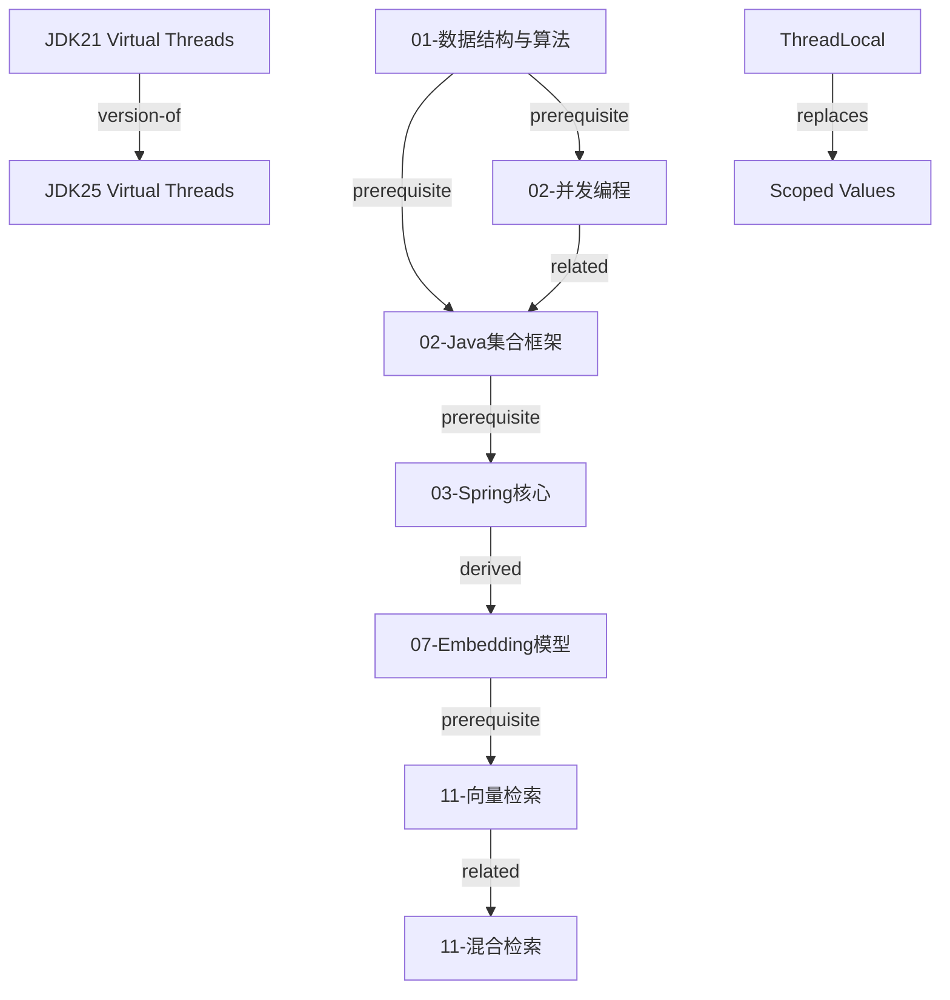

# 知识关系类型详解

## 概述

知识条目之间的关系是知识库从"文件集合"升级为"知识网络"的关键。通过在 frontmatter 的 `relations` 字段中建立结构化的条目间引用，我们构建了一个可遍历的有向知识依赖图。这个图让读者能够沿着关系边走查知识，帮助学习路径规划，也支持自动化的知识完整性检查（例如：引用了一个不存在的前置条目时报警）。

本知识库定义了六种知识关系类型：`prerequisite`、`related`、`derived`、`contrast`、`version-of` 和 `replaces`。每种关系具有明确的语义和约束。

---

## 核心内容

### 一、六种关系类型详解

#### 1.1 `prerequisite` — 前置依赖

**语义：** 要理解条目 B，必须先掌握条目 A。A 中定义的概念是 B 的认知前提。

**方向：** B → A（B 声明 A 是自己的前置依赖）。

**约束：**
- 是一种偏序关系（非对称，可传递）：若 B prerequisite A，C prerequisite B，则 C 隐含 prerequisite A。
- 不应形成循环依赖（检查工具应能检测并报警）。
- `prerequisite` 链的叶子节点通常是 `beginner` 级别的条目。

**使用场景：**

| B（当前条目） | A（前置条目） | 原因 |
|---|---|---|
| Spring Boot 自动配置原理 | Java 注解与反射 | 理解自动配置需要注解和反射知识 |
| Seata 分布式事务 | 数据库事务 ACID | 分布式事务是本地事务的扩展 |
| Spring AI Tool Calling | JSON Schema 规范 | Tool 定义基于 JSON Schema |
| Kubernetes Pod 调度 | Linux cgroup | Pod 资源限制底层机制 |

**示例（当前条目的 frontmatter）：**

```yaml
# 文件: 03-Java应用平台/03-spring-boot-auto-configuration.md
relations:
  prerequisite:
    - "02-Java平台/02-reflection-and-annotations"
    - "02-Java平台/02-class-loading-mechanism"
```

**学习路径可视化：** 将所有条目的 `prerequisite` 关系展开后，可以生成一个有向无环图（DAG），用于自动推荐学习顺序。工具可以为读者标出："在学习本条目之前，建议先完成以下 2 个前置条目"。

#### 1.2 `related` — 相关关系

**语义：** 条目 A 和 B 在主题上相互关联，建议并行或交叉学习，但没有严格的先后顺序依赖。

**方向：** 双向（对称关系）。如果 A related B，则 B 通常也会 related A。

**约束：**
- 是对称关系（但不会自动补全，两方都应在 frontmatter 中显式声明）。
- 不能同时也是 `prerequisite`（关系类型互斥；选择更精确的类型）。
- 适合建立"水平关联"而非"垂直依赖"。

**使用场景：**

| A | B | 关联点 |
|---|---|---|
| PostgreSQL 索引优化 | Elasticsearch 倒排索引 | 不同存储引擎的索引策略对比 |
| Redis 数据结构 | Java 集合框架 | 两种数据结构设计的对比学习 |
| MCP 协议 | A2A 协议 | 两个 AI 协议的互补理解 |
| Docker 容器化 | Kubernetes 编排 | 容器与编排的关系 |
| Virtual Threads | CompletableFuture | 两种并发编程模型 |

**示例：**

```yaml
# 文件: 04-数据与中间件/04-redis-data-structures.md
relations:
  prerequisite:
    - "01-计算机基础/01-数据结构与算法"
  related:
    - "02-Java平台/02-java-collections-framework"
    - "04-数据与中间件/04-redis-persistence"
```

#### 1.3 `derived` — 派生关系

**语义：** 条目 B 是条目 A 中理论或原理的直接应用或工程实现。A 是"为什么"，B 是"怎么做"。

**方向：** B → A（B 是 A 的派生应用）。

**约束：**
- 不对称、不可传递（B derived A，C derived B 不意味着 C derived A）。
- `derived` 意味着 B 不应该完全重复 A 中的理论内容，而应该引用 A 并在此基础上展开工程实践。
- 通常跨域使用。例如，域 07（AI 基础）中的理论条目被域 11（RAG）中的工程条目派生。

**典型派生链：**

```
07-AI基础/transformer-architecture (理论)
  └─ derived → 08-模型接入与推理/模型API/08-OpenAI兼容协议详解 (应用)
       └─ derived → 11-rag/hybrid-search (进一步应用)
```

**使用场景：**

| A（理论/基础） | B（应用/工程） |
|---|---|
| Transformer Self-Attention 原理 | Embedding 模型选择与评测 |
| CAP 定理 | 分布式事务方案选型 |
| MVCC 原理 | PostgreSQL 事务隔离级别实践 |
| B+Tree 索引原理 | MySQL 索引优化实战 |
| Tokenization 算法 | Token 计数与成本优化 |

**示例：**

```yaml
# 文件: 11-检索与RAG/11-hybrid-search-with-pgvector.md
relations:
  prerequisite:
    - "07-AI基础/07-embedding-models"
    - "04-数据与中间件/04-postgresql-indexing"
  derived:
    - "07-AI基础/07-vector-semantic-similarity"
```

#### 1.4 `contrast` — 对比关系

**语义：** 条目 A 和条目 B 针对同一问题提供了不同的技术方案，需要从多个维度（性能、复杂度、适用场景、生态）进行对比选型。

**方向：** 双向（对称关系）。

**约束：**
- 两方解决的是同一类问题（问题域一致）。
- 对比应尽量客观，基于可测量的指标（吞吐量、延迟、内存占用）而非主观偏好。
- `contrast` 关系的条目应该有一个做出"决策建议"的条目或段落。

**使用场景：**

| 方案 A | 方案 B | 对比维度 |
|---|---|---|
| Spring AI | LangChain4j | 生态、API 设计、Spring 集成度、学习曲线 |
| PostgreSQL pgvector | Qdrant | 数据规模、延迟、运维复杂度、混合检索 |
| Virtual Threads | WebFlux/Reactor | 吞吐量、内存、代码可读性、调试难度 |
| MyBatis | Spring Data JPA | SQL 控制力、开发效率、复杂查询支持 |
| Redis Cluster | Redis Sentinel | 可扩展性、运维复杂度、数据一致性 |

**示例：**

```yaml
# 文件: 09-Java AI框架/09-spring-ai-vs-langchain4j.md
relations:
  prerequisite: []
  related: []
  derived: []
  contrast: []
  version-of: []
  replaces: []
tags: ["spring-ai", "langchain4j", "framework-comparison", "java-ai"]

# 注意：两个被对比的条目各自也应标注 contrast 关系指向对比条目。
# 例如，在 spring-ai-overview.md 和 langchain4j-overview.md 中：
#   contrast: ["09-spring-ai-vs-langchain4j"]
```

**对比最佳实践：** 对比条目本身是一个独立的知识单元，包含对比矩阵、决策树和场景推荐。它不应该是两个条目的简单并列，而应该回答"在 X 场景下选择 Y 的理由"。

#### 1.5 `version-of` — 版本关系

**语义：** 条目 B 是条目 A 的新版本。A 和 B 讨论的是同一技术在不同版本下的知识。通常，A 会被标记为 `status: outdated`，B 标记为 `status: verified`。

**方向：** B → A（B 是 A 的新版本）。

**约束：**
- 新版本条目（B）应明确标注与旧版本（A）的差异变更。
- 旧版本条目（A）保留但不作为主要学习资料。
- 不适用于"替代技术"（那是 `replaces` 关系）。

**使用场景：**

| A（旧版本） | B（新版本） |
|---|---|
| JDK 21 Virtual Threads 初探 | JDK 25 Virtual Threads 深度解析 |
| Spring AI 1.x ChatClient | Spring AI 2.x ChatClient |
| Spring Boot 3.x 自动配置 | Spring Boot 4.x 自动配置 |
| HTTP/2 详解 | HTTP/3 (QUIC) 详解 |

**示例：**

```yaml
# 文件: 02-Java平台/02-virtual-threads-jdk25.md (新版)
relations:
  version-of: ["02-Java平台/02-virtual-threads-jdk21"]
# 旧版 frontmatter:
# status: "outdated"
# relations:
#   version-of: []  # 旧版可以不标注，或由新版反向引用
```

#### 1.6 `replaces` — 替代关系

**语义：** 技术 B 在大多数场景下替代了技术 A。A 不再是推荐的主栈方案。

**方向：** B → A（B 替代了 A）。

**约束：**
- `replaces` 是 `contrast` 的升级版——当对比结果明确倾向于一方且技术雷达已将其列入 Hold 时，使用 `replaces`。
- 被替代的条目（A）状态通常为 `outdated`，并保留作为历史参考。
- 替代不是永久的：如果技术格局再次变化，`replaces` 关系可以被移除。

**与 `version-of` 的区别：**
- `version-of`：同一技术的版本演进（JDK 21 → JDK 25）
- `replaces`：不同技术的此消彼长（Reactor 被 Virtual Threads 在多数场景替代）

**使用场景：**

| A（被替代） | B（替代者） | 判断依据 |
|---|---|---|
| Reactor/WebFlux（非响应式场景） | Virtual Threads | 技术雷达：Reactor 已降为 Trial |
| ThreadLocal（上下文传递） | Scoped Values | JEP 481 正式替代方案 |
| JUnit 4 | JUnit 5 | 社区已全面迁移 |
| Date/Calendar | java.time (JSR 310) | JDK 官方替代 |
| 手动 new Thread() | ExecutorService / Virtual Threads | 最佳实践转移 |

**示例：**

```yaml
# 文件: 02-Java平台/02-scoped-values.md
relations:
  prerequisite:
    - "02-Java平台/02-jmm-basics"
  replaces:
    - "02-Java平台/02-threadlocal-in-depth"
```

---

### 二、关系建立与维护

#### 2.1 关系建立的时机

| 阶段 | 行动 |
|---|---|
| **条目创建时** | 填写 `prerequisite` 和 `related`（创作者最清楚需要什么前置知识） |
| **条目审核时** | 审核人补充 `derived`、`contrast`（审核人有更广的全局视角） |
| **技术雷达更新后** | 检查是否需要新增 `replaces` 或 `version-of` 关系 |
| **定期维护时** | 扫描是否存在"断链"（引用了已删除或重命名的条目） |

#### 2.2 冗余关系避免

关系应该是最小化的——仅保留最精确的关系类型。例如：

- **反例：** A prerequisite B，同时 A related B（冗余，选更精确的 `prerequisite`）。
- **反例：** A replaces B，同时 A contrast B（`replaces` 隐含了对比结论）。
- **正例：** A prerequisite B，B related C（两者不冗余，各有独立语义）。

**判定优先级规则（关系互斥时的选择）：**
1. 如果 A 和 B 是同一技术的不同版本 → `version-of`
2. 如果 B 在技术雷达中替代了 A → `replaces`
3. 如果必须有先后学习顺序 → `prerequisite`
4. 如果 B 是 A 的应用/工程实现 → `derived`
5. 如果两者是竞争性方案需要对比 → `contrast`
6. 以上都不适用但有主题关联 → `related`

#### 2.3 大规模重命名与关系更新

当知识条目文件被重命名时，所有引用该文件的关系字段需要同步更新。建议使用脚本扫描所有 `.md` 文件的 frontmatter，检查是否存在不存在的引用目标。

**检测命令示例（bash 脚本思路）：**

```bash
# 扫描所有 relations 中的引用是否指向存在的文件
for md in knowledge/**/*.md; do
  # 提取 prerequisite/related/derived/contrast/version-of/replaces 值
  # 检查对应的 .md 文件是否存在
done
```

#### 2.4 关系图入度/出度平衡

一个健康的知识网络应避免两种极端：
- **孤立节点（入度=0, 出度=0）：** 没有任何关系的条目——可能是遗漏了关联。
- **超级枢纽（入度 >> 10）：** 太多条目指向同一个——可能是该条目过于"宽泛"，应考虑拆分。

---

### 三、知识图谱可视化建议

将 frontmatter 中的 `relations` 字段提取出来，可以生成知识图谱。以下是推荐的图结构映射：

| 关系类型 | 图示方式 | 说明 |
|---|---|---|
| `prerequisite` | 实线有向箭头 A→B | A 是 B 的前置 |
| `related` | 虚线无向连线 A---B | 对称关系 |
| `derived` | 空心有向箭头 A⇢B | 理论到应用 |
| `contrast` | 双箭头 A↔B | 双向对比 |
| `version-of` | 标注版本号的实线箭头 v1→v2 | 版本演进 |
| `replaces` | 红色箭头 + "X"标记 A↛B | B 替代 A |

**可视化工具建议：**
- **D3.js** 力导向图：适合交互式浏览器查看整个知识图谱。
- **Graphviz (DOT 语言)：** 适合生成静态图片嵌入到文档中。
- **Obsidian Graph View：** 如果使用 Obsidian 作为知识库前端（其 `[[wikilink]]` 语法可映射为关系）。
- **Mermaid：** 适合嵌入到 Markdown 中的轻量级图。

**Mermaid 示例（嵌入在 Markdown 中）：**



**大型图谱的分层展示建议：**
- **第 1 层（域级）：** 只展示 19 个知识域之间的关系。
- **第 2 层（条目级）：** 展示某个域内所有条目之间的关系。
- **第 3 层（概念级）：** 展示单个条目内部的概念图（通过标签系统实现）。

---

### 四、关系与学习路径生成

#### 4.1 拓扑排序生成学习路径

将所有条目的 `prerequisite` 边提取出来，对整个知识库做拓扑排序，可以得到建议的学习顺序。步骤如下：

1. 构建有向图 G = (V, E)，其中 V = 所有条目，E = 所有 prerequisite 边。
2. 检测是否存在环（有环意味着存在循环依赖，需要修正）。
3. 对 DAG 做拓扑排序。
4. 对拓扑排序的每一层（入度为 0 的节点组成一层），按域分组展示给读者。

#### 4.2 个性化推荐

- **基于已有基础推荐：** 标记已掌握的条目，找到"前置条件已满足"的条目集合。
- **基于目标推荐：** 从目标条目出发，反向追溯 prerequisite 链，生成缺失的前置知识清单。
- **基于兴趣推荐：** 利用 `related` 边做"猜你喜欢"（例如：学习了 Redis 数据结构的读者可能也对 Java 集合框架感兴趣）。

---

## 常见问题

**Q1: 如果我创建的新条目暂时不知道和谁关联怎么办？**

至少填写 `prerequisite` 和 `related` 为空数组 `[]`。之后在审核或交叉阅读时逐步补充。孤立条目会在定期的关系完整性扫描中被发现，触发补充提醒。

**Q2: `prerequisite` 和 `related` 的界限有时模糊，怎么判断？**

问自己："如果读者不理解 A，他能读懂 B 吗？" 如果答案是"不能"，则是 `prerequisite`。如果是"可以，但了解 A 会有更深的体会"，则是 `related`。

**Q3: 一个条目可以有多个同类型关系吗？**

可以。`prerequisite`、`related` 等字段的值是一个数组，可以包含任意数量的引用。

**Q4: 跨域关系如何表示？**

在引用值中加域前缀。例如，域 03 的条目引用域 02 的条目：
```yaml
prerequisite: ["02-Java平台/02-reflection-and-annotations"]
```
不加域前缀的引用默认为同域引用。

---

## 相关条目

- [[00-元数据规范与来源等级标准]] — 元数据规范与来源等级标准
- [[KNOWLEDGE_TAXONOMY]] — 知识域分类体系（含关系类型定义）
- [[TECHNOLOGY_RADAR]] — 技术雷达（`replaces` 关系的判断依据）
